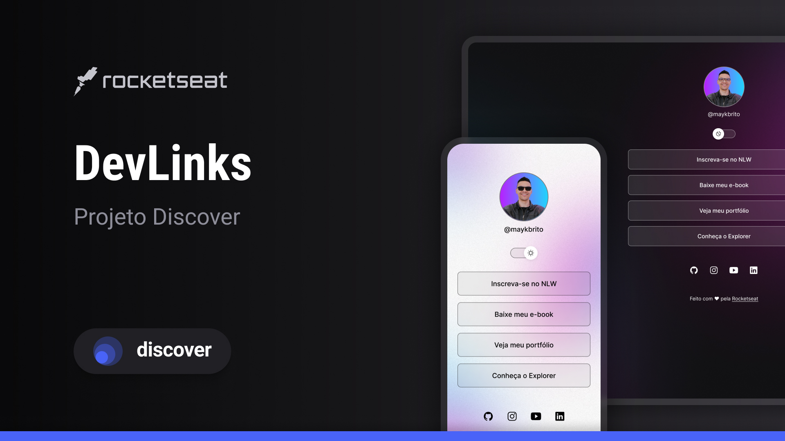

<h1 align="center">DevLinks</h1>

Progra exclusivo e gratuito, promovido pela Rocketseat para ensino de tecnologias WEB.

|
  <a href="#-tecnologias">Tecnologias</a> | 
  <a href="#-projeto">Projeto</a> | 
  <a href="#-layout">Layout</a> | 
  <a href="#memo-licença">Licença</a> | 

  

 

  

## :rocket: Tecnologias

Esse projeto fo desenvolvido com  as seguintes tecnologias:

- HTML e CSS3
- JAVASCRIPT
- GIT e GITHUB
- FIGMA

## :clipboard: Projeto

O DevLinks é um agregador de links para usar como cartão de visitas onLine.

## :: Layout

## :memo: Licença

Esse projeto está sob a licença MIT.